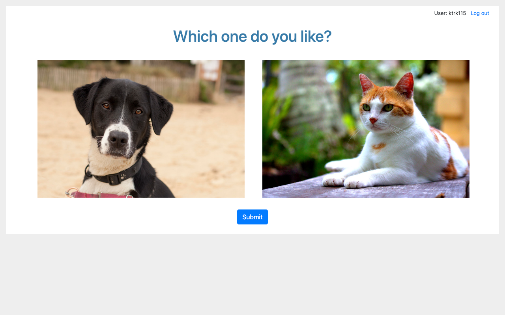

# PairComp

The simple app of pairwise comparison for image data.




## Install

Clone this repository.

```
$ git clone https://github.com/ktrk115/paircomp
$ cd paircomp/examples/paircomp
```

Create a virtualenv and activate it.

```
$ python3 -m venv venv
$ . venv/bin/activate
```

Install PairComp.

```
$ pip install -e .
```


## Play with example task

1. Initialize database and register tasks.

```
$ export FLASK_APP=paircomp
$ flask init-db
$ flask register-task example_task.csv
```

2. Run server.

```
$ flask run
```

3. Open http://127.0.0.1:5000 in a browser and do tasks.

4. Summarize the voting result.

```
# generate summary.csv
# column: img_0, # votes for img_0, img_1, # votes for img_1
$ flask get-summary
```
